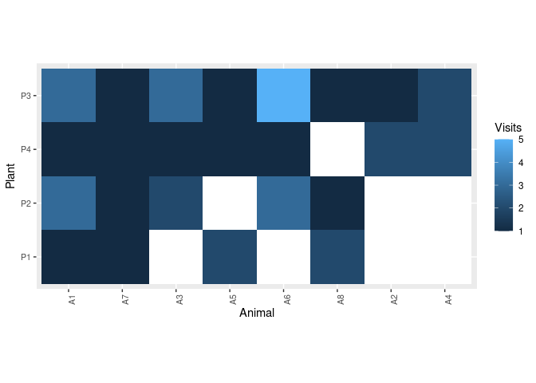
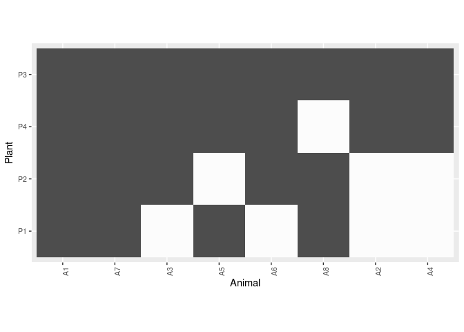
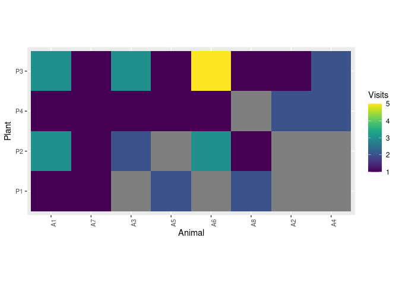

<!-- README.md is generated from README.Rmd. Please edit that file -->

# network.tools

<!-- badges: start -->

[](https://github.com/Pakillo/network.tools/actions/workflows/R-CMD-check.yaml)
[](http://hits.dwyl.com/Pakillo/network.tools)
[](http://hits.dwyl.com/Pakillo/network.tools)
<!-- badges: end -->

Tools to work with bipartite networks.

## Installation

You can install the development version of network.tools from
[GitHub](https://github.com/) with:

``` r
# install.packages("devtools")
devtools::install_github("Pakillo/network.tools")
```

## Usage

``` r
library(network.tools)
```

### Network visualisation

#### Visualise bipartite network as heatmap

``` r
data(web)
plot_web_heatmap(web)
```



Binarize the network (make it qualitative):

``` r
plot_web_heatmap(web, binarize = TRUE)
```



The output is a ggplot object that can be further modified:

``` r
plot_web_heatmap(web) + 
  ggplot2::labs(title = "A bipartite network")
```



### Data management

#### Transform interaction data from long to wide format

``` r
head(web)
#>   Plant Animal Visits
#> 1    P1     A1      1
#> 2    P1     A2      0
#> 3    P1     A3      0
#> 4    P1     A4      0
#> 5    P1     A5      2
#> 6    P1     A6      0
```

``` r
long2wide(web)
#>    A6 A1 A3 A4 A5 A7 A8 A2
#> P3  5  3  3  2  1  1  1  1
#> P2  3  3  2  0  0  1  1  0
#> P4  1  1  1  2  1  1  0  2
#> P1  0  1  0  0  2  1  2  0
```

#### Transform interaction data from wide to long format

``` r
mat <- long2wide(web)
wide2long(mat)
#> # A tibble: 32 × 3
#>    Plant Animal Visits
#>    <chr> <chr>   <int>
#>  1 P3    A6          5
#>  2 P3    A1          3
#>  3 P3    A3          3
#>  4 P3    A4          2
#>  5 P3    A5          1
#>  6 P3    A7          1
#>  7 P3    A8          1
#>  8 P3    A2          1
#>  9 P2    A6          3
#> 10 P2    A1          3
#> # ℹ 22 more rows
```

### Individual specialisation indices

Calculate indices of niche width and individual specialisation following
[Bolnick et
al. 2002](https://doi.org/10.1890/0012-9658(2002)083%5B2936:MILRS%5D2.0.CO;2).

``` r
data(web)
net <- long2wide(web)
net
#>    A6 A1 A3 A4 A5 A7 A8 A2
#> P3  5  3  3  2  1  1  1  1
#> P2  3  3  2  0  0  1  1  0
#> P4  1  1  1  2  1  1  0  2
#> P1  0  1  0  0  2  1  2  0
```

``` r
indiv_spec(net)
#>       WIC      TNW   IndSpec
#> 1 1.71828 2.008202 0.8556311
```

See the package [website](https://pakillo.github.io/network.tools) for
more information.

## Citation

``` r
citation("network.tools")
To cite package 'network.tools' in publications use:

  Rodriguez-Sanchez F (????). _network.tools: Tools to Analyse and
  Visualise Bipartite Networks_. R package version 0.0.5,
  https://pakillo.github.io/network.tools/,
  <https://github.com/Pakillo/network.tools>.

A BibTeX entry for LaTeX users is

  @Manual{,
    title = {network.tools: Tools to Analyse and Visualise Bipartite Networks},
    author = {Francisco Rodriguez-Sanchez},
    note = {R package version 0.0.5, https://pakillo.github.io/network.tools/},
    url = {https://github.com/Pakillo/network.tools},
  }
```
